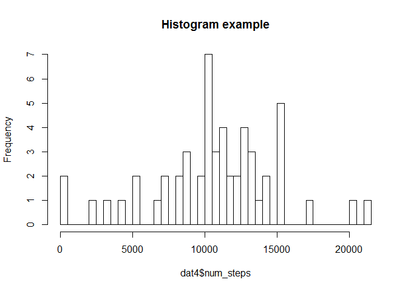
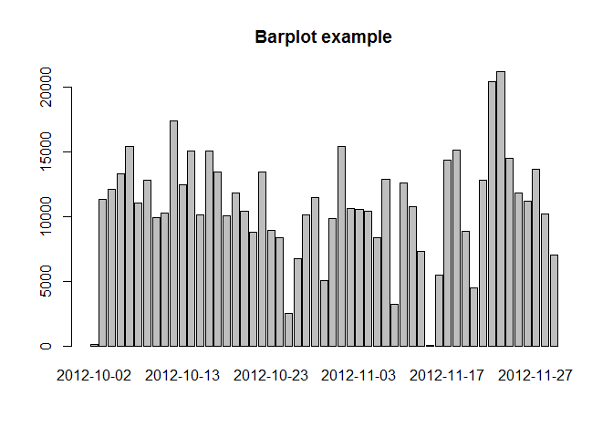
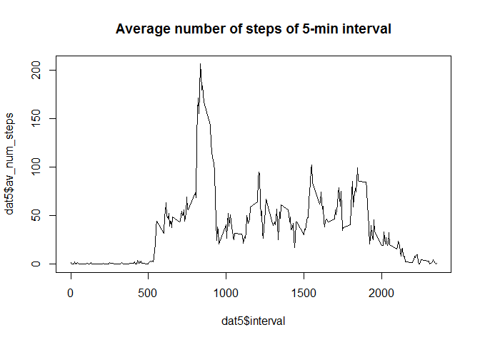
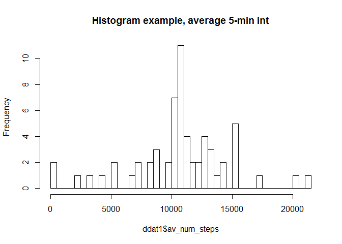

#Peer Assesment 1


#What is mean total number of steps taken per day?
##1. Calculate the total number of steps taken per day


```r
library(dplyr)
```

```
## 
## Attaching package: 'dplyr'
## 
## The following objects are masked from 'package:stats':
## 
##     filter, lag
## 
## The following objects are masked from 'package:base':
## 
##     intersect, setdiff, setequal, union
```

```r
#Reading data

dat <- read.csv(file = "activity.csv",header = TRUE, sep = ",", 
                stringsAsFactors = FALSE)

dat$date <- as.Date(x = dat$date, format = "%Y-%m-%d")

vec <- complete.cases(dat)

dat2 <- dat[vec,]

dat2_g <- group_by(dat2, date)

dat4 <- summarize(dat2_g, num_steps = sum(steps))

print(dat4)
```

```
## Source: local data frame [53 x 2]
## 
##          date num_steps
## 1  2012-10-02       126
## 2  2012-10-03     11352
## 3  2012-10-04     12116
## 4  2012-10-05     13294
## 5  2012-10-06     15420
## 6  2012-10-07     11015
## 7  2012-10-09     12811
## 8  2012-10-10      9900
## 9  2012-10-11     10304
## 10 2012-10-12     17382
## ..        ...       ...
```

##2. If you do not understand the difference between a histogram and a barplot, research the difference between them. Make a histogram of the total number of steps taken each day


```r
hist(dat4$num_steps, 35, main = "Histogram example")
```

 


```r
barplot(height = as.numeric(dat4$num_steps), names.arg = dat4$date)
title(main = "Barplot example")
```

 

##3. Calculate and report the mean and median of the total number of steps taken per day


```r
dats <- summarize(dat2_g, sum = sum(steps), mean = mean(steps), median = median(steps))

print(dats)
```

```
## Source: local data frame [53 x 4]
## 
##          date   sum     mean median
## 1  2012-10-02   126  0.43750      0
## 2  2012-10-03 11352 39.41667      0
## 3  2012-10-04 12116 42.06944      0
## 4  2012-10-05 13294 46.15972      0
## 5  2012-10-06 15420 53.54167      0
## 6  2012-10-07 11015 38.24653      0
## 7  2012-10-09 12811 44.48264      0
## 8  2012-10-10  9900 34.37500      0
## 9  2012-10-11 10304 35.77778      0
## 10 2012-10-12 17382 60.35417      0
## ..        ...   ...      ...    ...
```

#What is the average daily activity pattern?

##1. Make a time series plot (i.e. type = "l") of the 5-minute interval (x-axis) and the average number of steps taken, averaged across all days (y-axis)


```r
dat5_g <- group_by(dat2, interval)
dat5 <- summarize(dat5_g, av_num_steps = mean(steps))

plot(x = dat5$interval, y = dat5$av_num_steps, type = "l", 
     main = "Average number of steps of 5-min interval")
```

 

##2. Which 5-minute interval, on average across all the days in the dataset, contains the maximum number of steps?


```r
max_interval = dat5[dat5$av_num_steps == max(dat5$av_num_steps),]

print(max_interval)
```

```
## Source: local data frame [1 x 2]
## 
##   interval av_num_steps
## 1      835     206.1698
```

#Imputing missing values


##1. Calculate and report the total number of missing values in the dataset (i.e. the total number of rows with NAs)


```r
missing_values = sum(is.na(dat$steps))

print(missing_values)
```

```
## [1] 2304
```

##2. Devise a strategy for filling in all of the missing values in the dataset. The strategy does not need to be sophisticated. For example, you could use the mean/median for that day, or the mean for that 5-minute interval, etc.

###A strategy to fill in missing values is chosen to be the mean for that 5-minutes interval.

##3. Create a new dataset that is equal to the original dataset but with the missing data filled in.


```r
ddat <- merge(x = dat, y = dat5, by = "interval")


ddat <- arrange(ddat, date)


ddat <- within(ddat, newval_steps <- ifelse(is.na(ddat$steps), ddat$av_num_steps, ddat$steps))
```


##4. Make a histogram of the total number of steps taken each day and Calculate and report the mean and median total number of steps taken per day. Do these values differ from the estimates from the first part of the assignment? What is the impact of imputing missing data on the estimates of the total daily number of steps?

###4.1 Make a histogram of the total number of steps taken each day


```r
ddat_g <- group_by(ddat, date)

ddat1 <- summarize(ddat_g, av_num_steps = sum(newval_steps))

hist(ddat1$av_num_steps, 35, main = "Histogram example, average 5-min int")
```

 


###4.2.Calculate and report the mean and median total number of steps taken per day


```r
ddat2 <- mutate(ddat1, mean = mean(ddat_g$newval_steps), median = median(ddat_g$newval_steps))


ddats <- summarize(ddat_g, sum = sum(newval_steps), mean = mean(newval_steps), 
                   median = median(newval_steps))

print(ddats)
```

```
## Source: local data frame [61 x 4]
## 
##          date      sum     mean   median
## 1  2012-10-01 10766.19 37.38260 34.11321
## 2  2012-10-02   126.00  0.43750  0.00000
## 3  2012-10-03 11352.00 39.41667  0.00000
## 4  2012-10-04 12116.00 42.06944  0.00000
## 5  2012-10-05 13294.00 46.15972  0.00000
## 6  2012-10-06 15420.00 53.54167  0.00000
## 7  2012-10-07 11015.00 38.24653  0.00000
## 8  2012-10-08 10766.19 37.38260 34.11321
## 9  2012-10-09 12811.00 44.48264  0.00000
## 10 2012-10-10  9900.00 34.37500  0.00000
## ..        ...      ...      ...      ...
```

###4.3.Do these values differ from the estimates from the first part of the assignment? What is the impact of imputing missing data on the estimates of the total daily number of steps?

###As we see median data has changed as we used average 5-min interval values instead of NA values.

